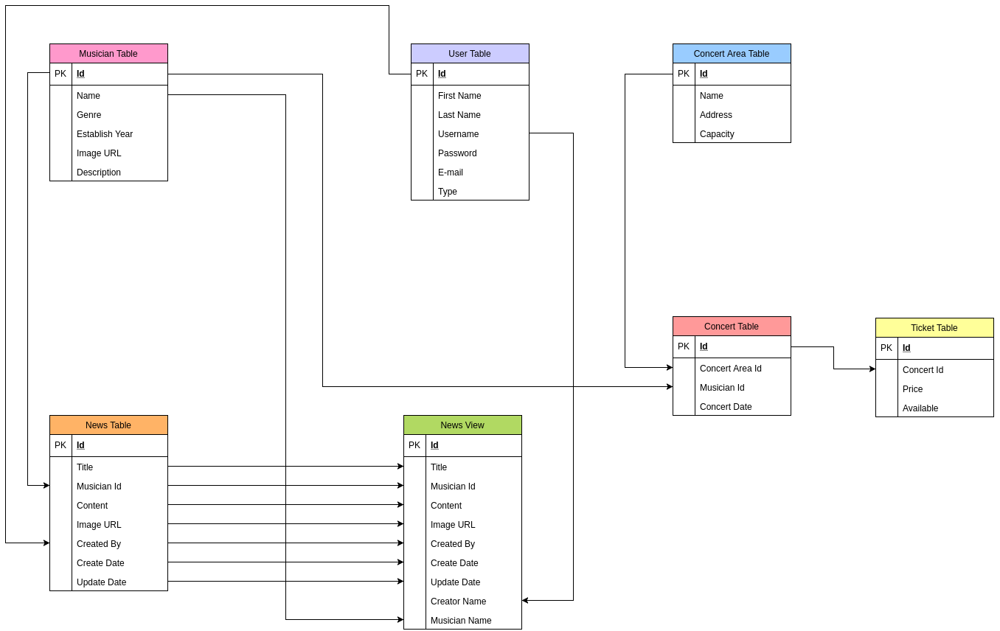

Developer Guide
===============

In our developer guide, we will explain how the project works and what operations have been implemented in technical terms. This is a guide intended for
developers to enjoy our work.

While developing we used:
   * Python, Flask, Psycopg2

   * HTML, CSS and Bootstrap

   * JavaScript and JQuery

   * Postgresql

   * Vagrant via VirtualBox

   * Github

   * Bluemix

Every developer will provide their ER diagrams on their own section.

You can see the general ER diagram which is created by using Microsoft Visio below:

     ER Diagram

**You can reach our source code by clicking here: https://github.com/itucsdb1730/itucsdb1730**

.. toctree::

   Elif Özer
   Onur Bozova